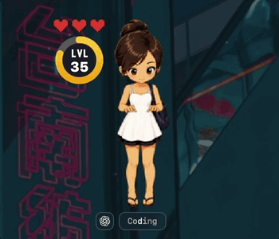

# Codogotchi

A macOS desktop companion that reacts to your AI coding agents in real time — idle, thinking, coding, testing, even dying when you neglect it. The pet floats on your desktop while you work, with one independent window per active AI platform.

**[⬇ Download for macOS](https://codogotchi.app/download)** · [Browse pets](https://codogotchi.app/gallery) · [codogotchi.app](https://codogotchi.app)



---

## Install

1. **[Download Codogotchi.dmg](https://codogotchi.app/download)**, open it, and drag **Codogotchi** to your Applications folder.
2. Clear the macOS quarantine flag (one-time — the build isn't notarized yet):
   ```bash
   xattr -cr /Applications/Codogotchi.app
   ```
3. Launch it. On first run, approve the **Welcome to Codogotchi** sheet to turn on agent animations.

That's it. No Terminal setup, no global installs — everything Codogotchi needs is inside the app.

> **Using Cursor, VS Code, or another editor?** After enabling hooks, **restart your editor** once so it picks them up.

---

## How it works

Your AI agents fire lifecycle events as they work. Codogotchi listens and animates the matching mood — coding, reading, testing, waiting, erroring, and more. Stay active and your pet thrives; neglect it and its hearts drain. It's a Tamagotchi for your coding sessions.

With **v2.0.0**, each active AI platform gets its own independent floating pet window. If you have Claude Code and Cursor running simultaneously, you see two separate pets — one reacting to each agent in real time. Open **Settings → Customization** to collapse platforms into a single combined window, turn a platform off, or adjust how long idle windows linger before auto-dismissing.

**v2.1.0** adds per-platform pet assignment and a Minimalist display mode. Open **Settings → Pet** to assign a different installed pet to each platform — leave any platform unassigned and it inherits the **Default** pet (Maew unless you change it). Assignments persist to `~/.codogotchi/assignments.json`. Open **Settings → Customization** and switch any platform to **Minimalist** to replace its pet window with a compact badge strip showing the platform, current state, attention level, and your latest prompt — no sprite, no RPG HUD. Upgrading from v2.0.0 keeps your existing pet as the Default everywhere with no setup. **Breaking change:** `codogotchi config set pet <id>` is removed — pet assignment now lives entirely in **Settings → Pet**.

**v2.2.0** adds per-session pets. Open **Settings → Platform Settings** (renamed from Platform Display Mode) and check **Enable Session Pets** for a platform in Own or Minimalist mode to get one pet panel per concurrent agent session on that platform — run three Claude Code sessions and see three panels labeled "Session 1/2/3" instead of one shared window. Pick a **Session Cap** (2–10, or Unlimited) to bound how many render at once; past the cap, an idle panel steps aside for an active one, and if every panel is busy a rate-limited bubble deep-links back to Settings. Right-click a session panel and choose **Rename…** (sticks for that session, ≤24 chars) or **Prune Session** (destroys it immediately and frees its number for reuse). Hovering a session's animation badge surfaces its last submitted prompt. Session Pets is **off by default for every platform** — upgrading from v2.1.0 changes nothing until you opt in.

**Works with:** Claude Code · Codex · Cursor · GitHub Copilot (VS Code) · Google Antigravity

Turn hooks on or off for any editor anytime in **Settings → General → Install / Update hooks**.

---

## Getting a pet

Codogotchi ships with **Maew**, a cute-flirty buddy animated across every agent state. Want something else? Four ways to get one:

| | How |
|---|---|
| 🐾 **Meet Maew** | The default pet — already in the app. |
| ✨ **Hatch your own** | Describe a character or drop a seed image and let AI draw a full animated pet. → [codogotchi.app/hatch](https://codogotchi.app/hatch) |
| 👥 **Adopt a community pet** | Browse pets made by other developers and install them in a click. → [codogotchi.app/gallery](https://codogotchi.app/gallery) |
| 🎨 **Draw your own** | Hand-draw a spritesheet using the reference spec. → [codogotchi.app/docs/spritesheet](https://codogotchi.app/docs/spritesheet) |

Switch between installed pets anytime in **Settings → Pet**, or assign a different pet to each AI platform. To publish a pet you made for others to adopt, sign in at [codogotchi.app/upload](https://codogotchi.app/upload).

---

## Hearts & levels

Codogotchi includes a free, fully local RPG layer — hearts, levels 1–100, and an XP ring that fills as you code. It runs entirely on your machine; nothing is uploaded. Prefer just the animations? Hide the heart HUD in **Settings → RPG**.

---

## FAQ

**Do I need to install anything besides the app?**
No. The app is self-contained — drag, drop, approve the welcome sheet.

**Where are my pets stored?**
In `~/.codogotchi/pets/`. Use the menu bar's **Reveal pet folder** item to open it in Finder.

**My pet isn't animating.**
Make sure hooks are installed (**Settings → General**) and, if you use Cursor or VS Code, that you restarted the editor afterward.

**Is my activity sent anywhere?**
No. The hearts/levels layer is local-only by default. Cloud sync and leaderboards are opt-in and not required to use Codogotchi.

**Why the `xattr` command?**
The app isn't notarized by Apple yet, so macOS quarantines the download. `xattr -cr` clears that flag — the same as right-click → Open. It'll go away once the app is notarized.

---

## Links

- 🌐 Website — [codogotchi.app](https://codogotchi.app)
- 🖼 Pet gallery — [codogotchi.app/gallery](https://codogotchi.app/gallery)
- ✨ Hatch a pet — [codogotchi.app/hatch](https://codogotchi.app/hatch)
- 📖 Spritesheet reference — [codogotchi.app/docs/spritesheet](https://codogotchi.app/docs/spritesheet)
- 🔒 [Privacy](https://codogotchi.app/privacy) · [Terms](https://codogotchi.app/terms)
- ✉️ Support & takedowns — admin@codogotchi.app
<br/>
<a href="https://www.producthunt.com/products/codogotchi?embed=true&amp;utm_source=badge-featured&amp;utm_medium=badge&amp;utm_campaign=badge-codogotchi" target="_blank" rel="noopener noreferrer"></a>

---

## Contributing & development

Codogotchi is open source. New to the codebase? **[START-HERE.md](START-HERE.md)** gives you the mental model in five minutes. For a deeper walkthrough — data flow, polling loop, renderers, and Swift/AppKit patterns explained for TS devs — check the **[Codogotchi for Dummies](https://codogotchipfordummies.vercel.app)** guide. To build from source or work on the macOS app, see **[CONTRIBUTING.md](CONTRIBUTING.md)**. We expect everyone to follow the **[Code of Conduct](CODE_OF_CONDUCT.md)**.

## License

[PolyForm Noncommercial 1.0.0](LICENSE) — free for personal and noncommercial use.
